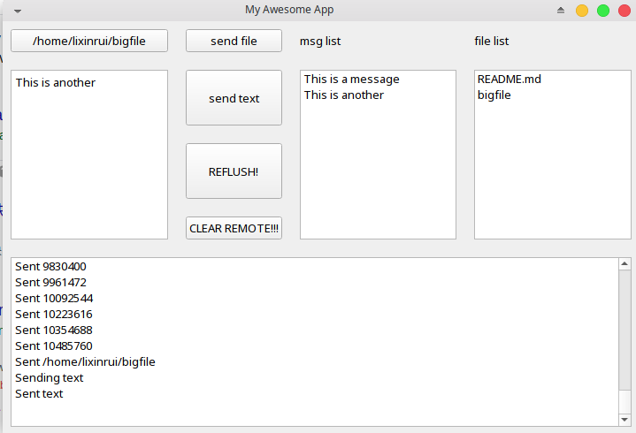
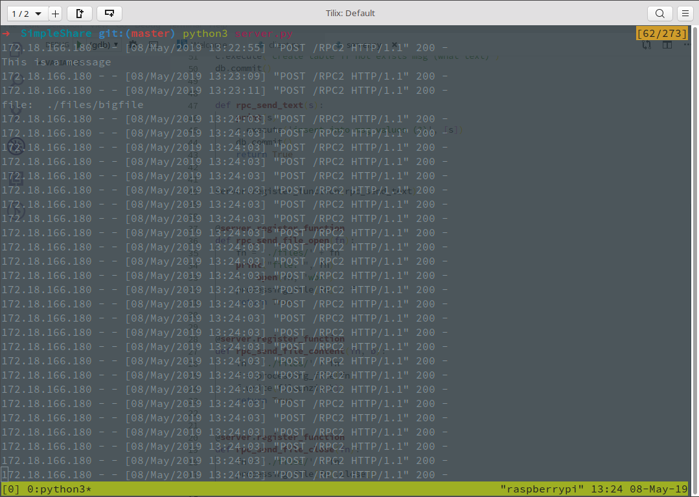

# SimpleShare
Easy to use, cross platform FILE and TEXT sharing tool.

Written with PyQt

## Usage:

Run server.py on one machine and edit the `serveraddr` in client.py. 

Run client.py, open file or write down something in the left most text box and send it!

After sending, click REFLUSH! to update the mesage/file list. Doule click to copy the text or download the file.

